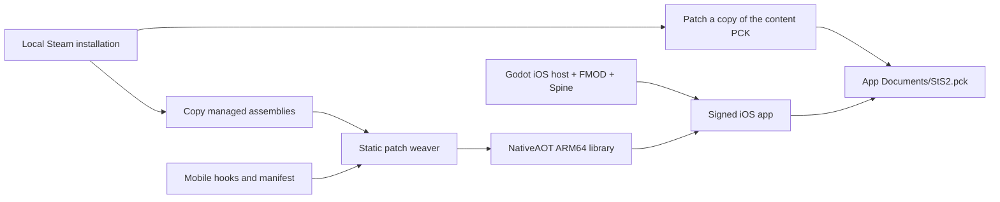

# Architecture

The iOS port reuses the game's locally installed managed assembly and content,
compiling the patched assembly into a native iOS library.

## Static patches and NativeAOT

`src/STS2Weaver` uses Mono.Cecil to insert the prefix/postfix hooks listed in
`src/STS2MobileIos/manifest.json`. All entries must succeed before the output
assembly replaces a previous build. This is a deliberately limited weaver, not a
general implementation of Harmony. Patch signatures must match the game version.

The hooks adapt platform startup, local settings, touch input, UI layouts and
background/resume. Steam initialization and unavailable Sentry functionality are
skipped. Steam login and cloud sync are not implemented.

`ios/sts2.csproj` creates an empty build assembly and then replaces it with the
woven `sts2.dll` after `CoreCompile` and before `IlcCompile`. NativeAOT compiles
the resulting assembly and dependencies into an iOS ARM64 library. Godot roots
the main assembly; the project also roots the mobile hooks and enables reflection
for JSON serialization. Reflection/trimming warnings still require runtime
testing of the affected paths.

No runtime JIT or Harmony patching is required by this workflow. Desktop mods
that depend on those mechanisms are not supported by implication.

## Host and native extensions

The Godot exporter receives a separate shell under `.cache/ios-host`, without a
.NET solution. This avoids its additional simulator builds. The device library
is published separately and embedded as `sts2.framework` by `prepare_xcode.py`.
The generated host includes native FMOD/Spine libraries, a registration stub for
the game's empty custom-FMOD-plugin list, landscape orientations and file sharing.

The app launches with `--main-pack user://StS2.pck`. The game pack supplies the
actual project settings and scenes; the small shell PCK in `ios/build` is not a
replacement for the game content.

## Content compatibility

The current PCK utilities support the tested unencrypted Godot format v3.
They remove Sentry's extension entry and add placeholder `.cs` resources for
embedded script paths so stock Godot can bind scenes to their compiled types.
The tested game required 709 placeholders; that is a version-specific observation.
Outputs are patched as copies and replaced atomically on success.

An eager scan of thousands of shaders and scenes caused minutes of first-launch
stutter in an early prototype. The port omits that scan and lets Godot cache
shaders as encountered. First-use/loading stalls remain possible.

## Source map

| Path | Purpose |
| --- | --- |
| `src/STS2MobileIos/` | Runtime hooks and optional frame recorder |
| `src/STS2Weaver/` | Build-time IL patching |
| `scripts/ios/` | Bootstrap, preparation, build, installation, tests and benchmarking |
| `ios/` | Godot shell, NativeAOT project, config/export templates |
| `tests/ios/` | Engine-independent frame-accounting tests |
| `docs/` | Public guides and anonymized benchmark reference |

Ignored paths contain local inputs and artifacts: `upstream/`, `vendor/`,
`.tools/`, `.cache/`, `ios/addons/`, `ios/prebuilt/`, `ios/build/`, and `.godot/`.
Game files, compiled applications, saves, signing data and raw logs are not source.

## Dependency versions

| Component | Revision used |
| --- | --- |
| Original launcher provenance | Ekyso/StS2-Launcher, `1e97cf83a6f030ae639de12c3e953dbc8431b552` |
| Community iOS patches/weaver | jhaizhou-ops/sts2-ios, `be1144212c7d5ac5d6c78fa56f7cb1d969397389` |
| Godot .NET editor/templates | Official 4.5.1 stable |
| .NET SDK | 9.0.318 |
| Mono.Cecil | 0.11.6 |
| FMOD Godot extension | 6.1.0-4.5.0 |
| Spine 4.2 runtime | `e7dc1435fa4a0083ab431f1b28e083c14a1f5c68` |
| godot-cpp | `e83fd0904c13356ed1d4c3d09f8bb9132bdc6b77` |
| SCons | 4.11.1 |

Archive checksums and download locations are in `scripts/ios/bootstrap.py`.
See [third-party notices](../THIRD_PARTY_LICENSES.md) for attribution and licenses.
