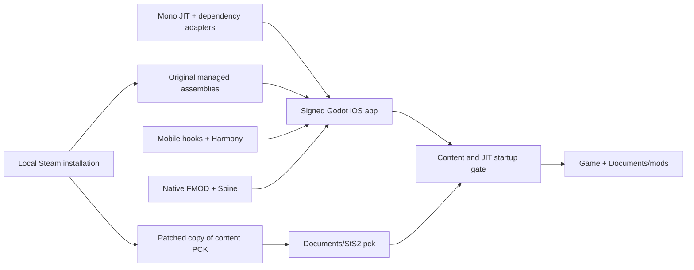

# Architecture

The iOS port runs the locally supplied game assembly under Mono JIT inside
Godot's iOS host. Runtime Harmony patches provide mobile adaptations.

## Managed runtime and hooks

`ios/jit/RuntimeHost.mm` implements Godot's managed entry ABI and initializes
Mono with the iOS runtime pack. `src/STS2Jit/Entry.cs` applies every hook in
`src/STS2MobileIos/manifest.json` through Harmony, then redirects the game's mod
scan to `Documents/mods`. Hook failures abort initialization. The stock loader
retains consent, dependencies, enabled state and modded save isolation.

The hooks adapt platform startup, settings, touch input, layouts and suspension.
Steam platform initialization and unavailable Sentry functionality are skipped.
The Cloud browser uses separate HTTPS/TLS WebSocket clients; active saves remain
local. Automatic Cloud synchronization is not implemented.

`STS2JitPrepare` uses Mono.Cecil to adapt pinned copies of CoreLib and Harmony;
`STS2JitSupport` connects Harmony patch writes to registered Mono code regions.
Game and mod assemblies are copied unchanged. See [runtime design and limits](jit.md#runtime-design-and-limits)
for executable/writable aliases, initialization timing and diagnostic limitations.

`Lan/LanSession` opens the game's ENet transport and hands sessions to its normal
lobbies and handshake. Bonjour discovery is supplied by the native bridge, and
a persistent client ID is separate from the local save account. See [LAN support](multiplayer.md).

## Build and native host

`build.py` is the command entry point for preparation, runtime compilation, app
building, installation and JIT activation. `jit.py` supplies the runtime/build
backend. Each build exports a new shell from `.cache/ios-host/` into
`.cache/jit-host/`, compiles `sts2.framework`, and uses `prepare_xcode.py` to attach
the framework, native bridge and JIT gate. The host has no .NET project and needs
no simulator compilation. Xcode products live in `.cache/xcode-jit/`.

After Xcode builds, the app receives the original game assemblies, iOS BCL,
mobile hooks, dependency adapters and native runtime libraries, then is signed
again. The managed output directory is rebuilt so removed assemblies cannot
survive an incremental build. Build/install/launch/backup/profiling use the exact
configured bundle ID.

The native gate creates the shared Documents folder before Godot starts. It waits
for `StS2.pck` to reach the prepared size and for the process to have JIT permission.
The runtime also executes a native-code probe to check executable memory and
writable aliases. There is no alternate managed execution mode.

The game starts with `--main-pack user://StS2.pck`; that pack supplies project
settings and scenes. The small exported shell PCK cannot replace game content.
The host enables landscape orientation, Files sharing and local network access.

`ios/Sts2Native.mm` is included by the generated Objective-C++ host. It activates
the iOS playback audio session, stores Steam refresh tokens in Keychain, and
generates login QR images using Core Image. The executable exports native bridge
functions while preserving FMOD's plugin-registration symbols. Managed hooks
resolve bridge functions from the process at runtime.

`MobileUi` creates a separate canvas layer for the FPS display and iOS menu.
Long presses on card-list holders open the game's existing upgraded-card
inspection screen and consume the release so the card is not selected or bought.
Combat hand dragging retains its original input behavior.

## Content compatibility

The current PCK utilities support the tested unencrypted Godot format v3.
They remove Sentry's extension entry and add placeholder `.cs` resources for
embedded script paths so stock Godot can bind scenes to their compiled types.
The tested game required 709 placeholders; that is a version-specific observation.
Outputs are patched as copies and replaced atomically on success.

An eager scan of thousands of shaders and scenes caused minutes of first-launch
stutter in an early prototype. The port omits that scan and lets Godot cache
shaders as encountered. First-use/loading stalls remain possible.

## Source map

| Path | Purpose |
| --- | --- |
| `src/STS2Jit/` | Managed entry point, Harmony hooks and mod discovery |
| `src/STS2JitPrepare/` | Build-time adapters for pinned runtime dependencies |
| `src/STS2JitSupport/` | Runtime support for Harmony patch writes and signatures |
| `src/STS2MobileIos/` | Mobile UI, hooks, Cloud, LAN and optional frame recorder |
| `scripts/ios/` | Bootstrap, build, installation, backup, tests and benchmarking |
| `ios/` | Godot shell, native bridge, JIT runtime sources and export/config templates |
| `tests/` | Offline frame, Cloud and LAN checks |
| `docs/` | Current usage, compatibility and architecture guides |

Ignored paths contain local inputs and artifacts: `upstream/`, `vendor/`,
`.tools/`, `.cache/`, `ios/addons/`, and `.godot/`. Game files, compiled apps,
saves, signing data and raw logs are not source.

## Dependency versions

| Component | Revision used |
| --- | --- |
| Original launcher provenance | Ekyso/StS2-Launcher, `1e97cf83a6f030ae639de12c3e953dbc8431b552` |
| Community iOS patches and content tools | jhaizhou-ops/sts2-ios, `be1144212c7d5ac5d6c78fa56f7cb1d969397389` |
| Godot .NET editor/templates | Official 4.5.1 stable |
| .NET SDK | 9.0.318 |
| Mono runtime | 9.0.20 (`3879076d9a06ce098d37c3882fb1845a6627335b`) |
| Harmony | 2.4.2.0, adapted locally |
| Mono.Cecil | 0.11.6 |
| FMOD Godot extension | 6.1.0-4.5.0 |
| Spine 4.2 runtime | `e7dc1435fa4a0083ab431f1b28e083c14a1f5c68` |
| godot-cpp | `e83fd0904c13356ed1d4c3d09f8bb9132bdc6b77` |
| SCons | 4.11.1 |

Archive checksums and download locations are in `scripts/ios/bootstrap.py` and `scripts/ios/jit.py`.
See [third-party notices](../THIRD_PARTY_LICENSES.md) for attribution and licenses.
