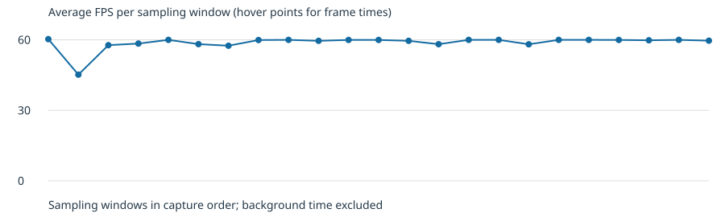

# iPad gameplay benchmark - 2026-10-02

The port sustains close to 60 FPS in this short gameplay sample. Scene loading
has a larger effect on responsiveness than sustained frame throughput.

## Setup

- Physical M4 iPad Pro 11-inch running iPadOS 18.1.
- NativeAOT Release build, Steam game v0.111.0, Godot 4.5.1.
- Metal mobile renderer at 2420 x 1668, 60 FPS cap.
- Eager shader warmup disabled; the existing shader cache was retained.
- Two-minute capture while a tester played a fresh vanilla iOS run. Desktop and
  cloud saves were not accessed. No background/resume events occurred.
- Per-frame process cadence recorded in the game; DVT sampled app CPU and memory
  plus device-wide GPU/compositor counters over the paired network connection.
- Frame accounting tests and all six Python pack/report tests passed. The signed
  build was installed and ran successfully on the physical device.

## Results

| Metric | Gameplay | All active scenes |
| --- | ---: | ---: |
| Recorded active time | 95.13 s | 115.22 s |
| Frames | 5,660 | 6,773 |
| Average FPS | 59.50 | 58.78 |
| 1% low FPS | 23.94 | 16.01 |
| Median frame interval | 16.67 ms | 16.67 ms |
| p95 frame interval | 17.86 ms | 17.75 ms |
| p99 frame interval | 29.04 ms | 29.04 ms |
| Worst frame interval | 104.07 ms | 1,266.08 ms |
| Frames over 50 ms | 7 | 11 |
| Frames over 100 ms | 1 | 4 |

The longest interval occurred in a batch spanning a scene transition. Gameplay
includes combat, maps, rewards and menus within a run; it is not a combat-only
measurement. The 1% low is the reciprocal of the mean of the slowest 1% of frame
intervals, so it is sensitive to the occasional longer stalls.

| Counter across capture | Median | p95 | Peak |
| --- | ---: | ---: | ---: |
| App CPU (% of one core) | 46.18% | 53.37% | 96.10% |
| App physical memory footprint | 1.49 GiB | 1.52 GiB | 2.58 GiB |
| Device GPU utilization | 53% | 60% | 83% |
| Device compositor FPS | 60 | 60 | 60 |

CPU uses one core as 100%, not total device capacity. There were 228 valid CPU
samples, 231 memory samples, and 119 graphics samples. The memory peak occurred
during startup; the median does not establish whether longer sessions leak memory.
Device-wide GPU counters suggest capacity remained in this sample but do not
identify the cause of individual game stalls.

## Interpretation and limits

Investigate scene loading and first-use work before lowering render resolution.
The next useful performance measurement is a controlled repeat of the same scene
transition, followed by a longer session to observe memory and thermal behavior.
This run does not measure battery life, thermal throttling, or cold-cache startup.

Frame intervals are SceneTree process cadence, not GPU completion timestamps.
Recording and profiler overhead are included. Only complete batches inside the
capture window count, accounting for the difference between the two-minute
capture and 115 seconds of frame data. No baseline replay was performed, so these
results cannot establish a percentage improvement over the earlier build.

Only aggregate results and the derived chart are published here. Raw frame data,
device logs and identifiers are excluded from Git. The capture implementation
and reproduction commands are documented in [the performance guide](../performance.md).
